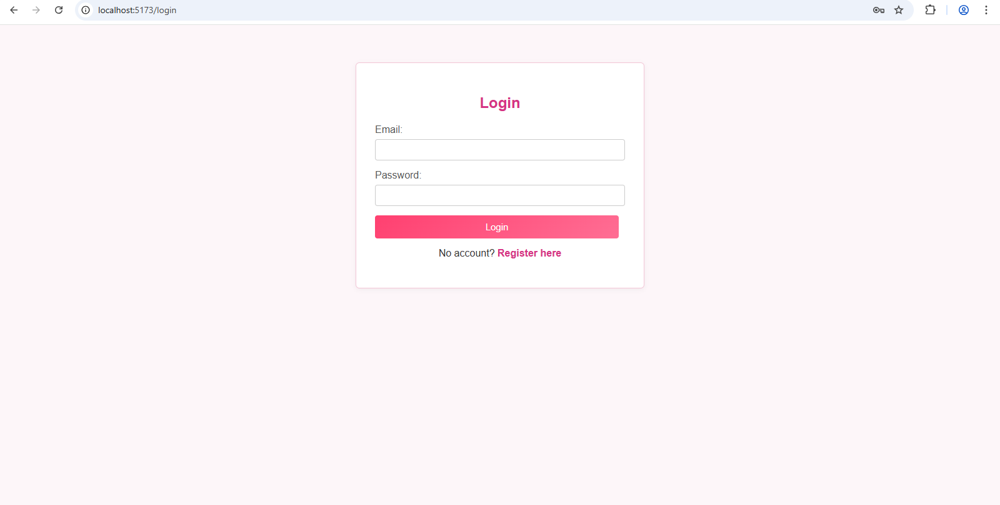
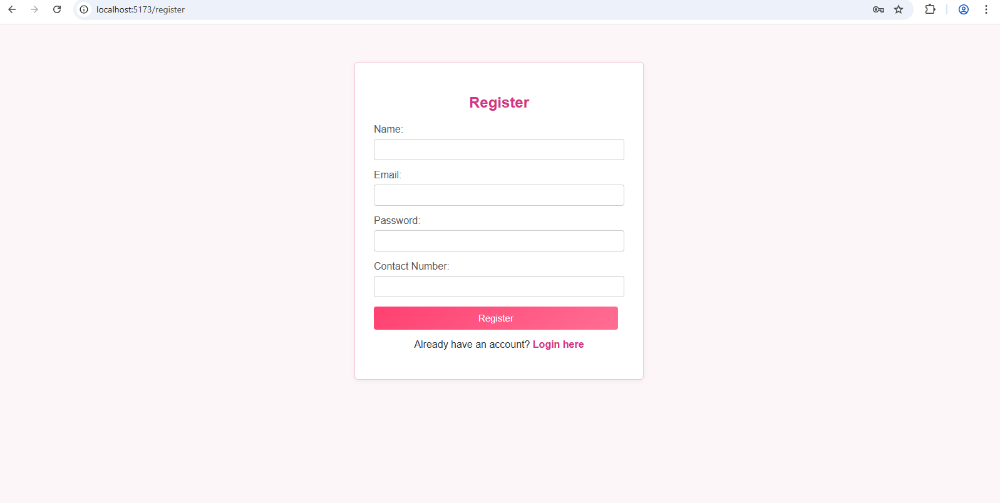
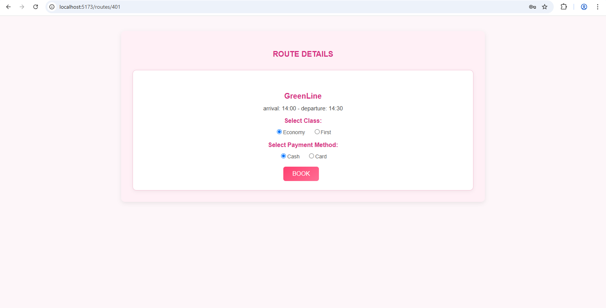

# 🚄 Train Management System

A full-stack CRUD web application for managing trains and routes. Built using *React, **Node.js, **Express, and **SQL Server*.

---

## 📸 Screenshots
| Login Page | Dashboard | Add Train |
|------------|-----------|-----------|
|  |  |  |

---

## 🛠 Tech Stack

### Frontend
- React.js (Functional Components, Hooks)
- CSS

### Backend
- Node.js
- Express.js
- SQL Server (with Microsoft SQL Management Studio)
- JWT (Authentication)
- Bcrypt (Password Hashing)
  
---

## 🔐 Features

- 🧑‍💼 *User Authentication* (JWT + bcrypt)
- 📋 *CRUD Operations*: Add, view, update, and delete data
- 🔒 *Protected Routes*
- 📱 *Responsive UI*
- 🧠 *State Management* with useState and useEffect

---

